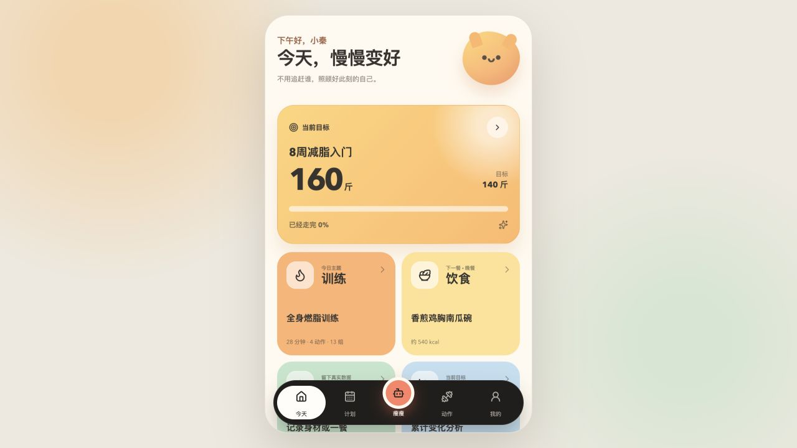
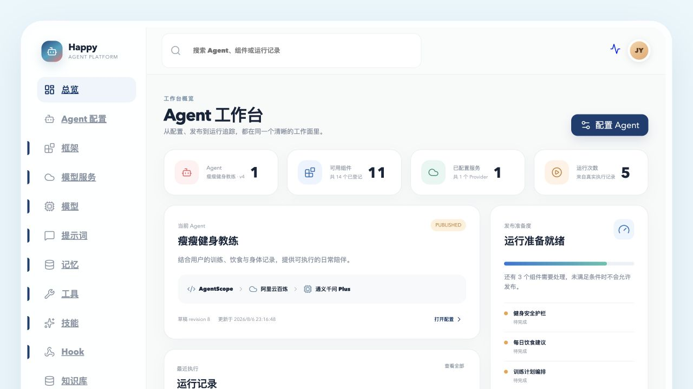
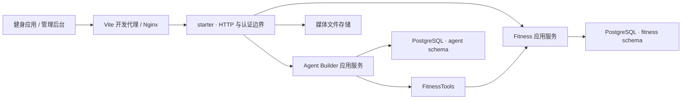

# Happy Agent Platform

Happy Agent Platform 是一个自用 AI Agent 平台，也是一个面向真实业务场景的模块化单体应用。当前首个落地产品是 AI 健身伙伴：移动端负责目标、训练、饮食、身体数据与 AI 陪伴，管理端负责 Agent 组件配置、评测、发布和运行观测。

| 健身应用 | Agent 管理后台 |
| --- | --- |
|  |  |

## 核心能力

### 健身应用

- 目标管理、偏好设置与当前目标进度报告
- 训练计划、动作库、训练执行与历史记录
- 每日三餐计划、饮食记录、图片识别与反馈
- 体重、体脂等身体指标记录
- AI 会话、流式响应、执行审批与运行状态追踪

### Agent 管理后台

- Framework、Provider、Model、Tool、Skill、Hook、Memory 等组件管理
- Prompt、Output Schema、Evaluation Suite 的版本化配置
- Agent 草稿解析、评测、发布与回滚
- Playground、会话、运行、Trace 和分析面板
- 知识库绑定与默认 Profile 管理

## 技术栈

| 层次 | 技术 |
| --- | --- |
| 后端 | Java 17、Spring Boot 3.5、Maven |
| 前端 | React 19、TypeScript 5、Vite 7 |
| 数据库 | PostgreSQL 16、pgvector、Flyway |
| 测试 | JUnit、Testcontainers、ArchUnit、Vitest、Playwright |
| 部署 | Docker、Docker Compose、Nginx、阿里云 ECS、阿里云 ACR |

## 架构概览



项目采用模块化单体架构，`starter` 是唯一可执行模块。Fitness 与 Agent Builder 保持明确边界：

- 一个 PostgreSQL 实例、一个数据库、两个独立所有者 Schema：`fitness` 与 `agent`
- 两套独立 DataSource 和 Flyway 流程
- 禁止跨 Schema 外键、事务和直接查询
- Agent 只能通过 `FitnessTools` 访问健身能力，不能依赖 Fitness Repository
- 移动端与管理端使用彼此独立的认证边界

## 目录结构

```text
.
├── application/fitness/       # 健身领域、应用服务与基础设施
├── agentbuilder/              # Agent 核心、服务、框架适配与基础设施
├── starter/                   # Spring Boot 启动模块与 HTTP Controller
├── frontend/                  # React 移动端和管理后台
├── architecture-tests/        # 模块边界与架构约束
├── deploy/                    # 本地和生产部署脚本
├── docs/                      # 产品、架构、OpenAPI 与验收资料
└── scripts/                   # 契约生成、数据初始化等工具
```

## 本地开发

### 环境要求

- Java 17
- Docker 与 Docker Compose
- Node.js 与 npm
- Bash、curl

仓库已包含 Maven Wrapper，无需单独安装 Maven。

### 一键启动

```bash
./deploy/local-run.sh
```

脚本会初始化本地密钥、启动 PostgreSQL、构建并运行后端，然后启动 Vite：

- 前端入口：<http://127.0.0.1:5173>
- 管理后台：<http://127.0.0.1:5173/admin>
- 后端端口：`127.0.0.1:8080`
- 后端日志：`deploy/.local/backend.log`

前端开发环境通过 Vite 将 `/api` 代理到本地后端，因此业务代码不需要配置另一套后端域名。

本地运行产生的数据库、密钥和环境文件位于 Git 忽略目录中，不应提交到版本库。

### 常用命令

```bash
# 后端测试（集成测试需要 Docker）
./mvnw test

# 跨模块改动后的架构测试
./mvnw -pl architecture-tests -am test

# Java 格式检查与自动格式化
./mvnw spotless:check
./mvnw spotless:apply

# 前端测试、类型检查与代码检查
npm --prefix frontend test
npm --prefix frontend run typecheck
npm --prefix frontend run lint

# 端到端测试
npm --prefix frontend run e2e
```

## API 契约优先

移动端和管理端 API 的源文件分别是：

- [`docs/architecture/openapi/public-v1.yaml`](docs/architecture/openapi/public-v1.yaml)
- [`docs/architecture/openapi/admin-v1.yaml`](docs/architecture/openapi/admin-v1.yaml)

修改接口时先更新 OpenAPI，再生成并提交 TypeScript 类型：

```bash
node scripts/contracts/lint.mjs
node scripts/contracts/generate-types.mjs
git diff --exit-code frontend/src/api/generated
```

不要先修改 Java Controller 或手写生成目录中的类型。

## 生产部署

生产环境使用阿里云 ECS、私有 ACR、Docker Compose 和 Nginx：

1. 本地将 PostgreSQL、Spring Boot App 和 Web 构建为 `linux/amd64` 镜像。
2. 镜像推送到阿里云 ACR 私有仓库。
3. 部署脚本通过 SSH 上传配置与脚本，ECS 从 ACR 拉取镜像。
4. 首次迁移会导出本地数据库、媒体和 Agent 主密钥，在 ECS 上进行隔离校验后切换数据代际。
5. 日常发布先备份，再切换 App/Web；PostgreSQL 不随普通代码发布重启。
6. 健康检查或公网检查失败时回到上一版本。

生产编排入口：

```bash
deploy/production/deploy.sh bootstrap
deploy/production/deploy.sh migrate
deploy/production/deploy.sh release
deploy/production/deploy.sh status
deploy/production/deploy.sh backup
deploy/production/deploy.sh rollback <RELEASE_ID>
```

其中 `bootstrap` 和 `migrate` 属于首次上线流程；后续代码更新通常只执行 `release`。生产脚本包含目标实例、镜像来源和安全组等保护性校验，执行前应确认当前配置确实指向目标环境。

ACR 登录信息只允许保存在 Git 忽略的本地文件中，并保持 `0600` 权限：

```text
deploy/.local/production/acr-username
deploy/.local/production/acr-password
```

不要把 ACR 密码、SSH 私钥、数据库密码、Session 或 Agent 主密钥写进源码、README、命令行参数或日志。

### 域名与请求流转

计划使用以下生产入口：

- 健身应用：`fitness.modest.vip`
- 管理后台：`agent.modest.vip`

域名解析、备案与证书就绪后，浏览器访问对应域名，请求先进入 ECS 上的 Nginx。静态页面由 Web 容器提供，`/api` 请求由 Nginx 转发给 App 容器，因此前端仍使用同源相对路径，不需要感知后端容器地址或额外后端域名。

### 数据、媒体与备份

当前生产数据保存在 ECS 的持久化代际目录中：

```text
/opt/happy-agent/state/current/
├── postgres/          # PostgreSQL 数据目录
├── media/             # 用户上传的图片等媒体资源
└── agent-master-key   # Agent 凭证加密主密钥
```

`state/current` 是指向当前数据代际的符号链接。恢复流程先在隔离代际校验数据库、媒体和密钥，全部通过后再原子切换，避免半恢复状态。

目前媒体文件存储在 ECS 本地持久化目录，而不是 OSS。前端只保存和请求后端返回的媒体 URL，由 Nginx/App 提供访问；未来迁移到 OSS 时可以保持 API URL 契约不变。

数据库、媒体文件、主密钥和发布元数据必须一起备份。ECS 本机备份只能用于快速恢复，仍应定期将备份复制到另一台主机或对象存储，避免单机故障导致数据与备份同时丢失。

## 安全约束

- Secret 只从环境变量或 Git 忽略的本地文件读取
- 移动端和管理端认证不能复用或降级
- 生产环境只公开 SSH、HTTP 和 HTTPS 所需端口
- PostgreSQL 和应用内部端口不直接暴露到公网
- 发布前执行备份，失败发布必须保留上一版本和数据库状态
- 禁止提交 `.env`、私钥、数据库转储、Cookie 或云端凭证

## 延伸文档

- [产品设计](docs/product/product-design.md)
- [功能验收清单](docs/product/feature-checklist.md)
- [模块边界](docs/architecture/module-boundaries.md)
- [数据模型](docs/architecture/data-model.md)
- [生产部署设计](docs/superpowers/specs/2026-08-13-aliyun-ecs-ip-https-deployment-design.md)

## License

当前仓库未声明开源许可证，默认保留全部权利。
